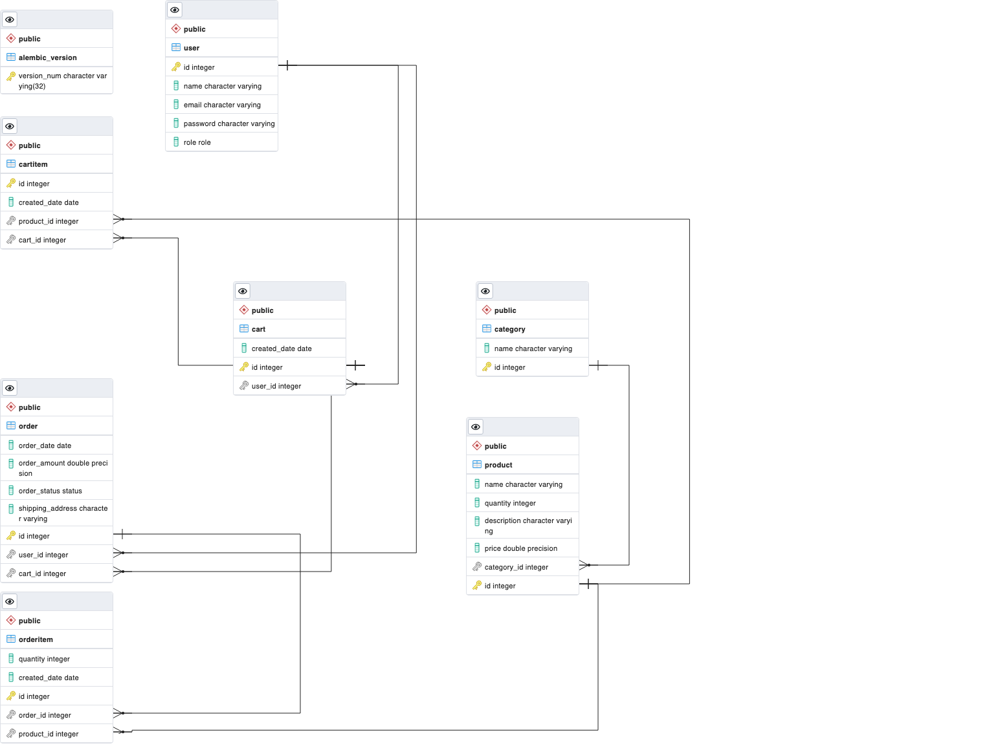

# Project Overview

The aim of this project is to create a simple RESTful API for ecommerce system using Python FastAPI, SQLModel, SQLAlchemy, Alembic, Postgres DB and Pytest.

## Database models



## API endpoints

### Auth

- POST /login: Authenticate an user

### Users

- GET /users: Get all users
- GET /users/{id}: Get user by id
- POST /users: Create new user
- PUT /users/{id}: Edit user by id
- DELETE /users/{id}: Delete user by id
- PUT /users/{id}/password: Modify user's password

### Category

- GET /categories: Get all categories
- GET /categories/{id}: Get category by id
- POST /categories: Create new category
- DELETE /catetories/{id}: Delete category by id

### Product

- GET /products: Get all products
- GET /products/{id}: Get product by id
- POST /products: Create new product
- PUT /products/{id}: Update product by id
- DELETE /products/{id}: delete product by id

### Cart

- GET /carts: Get all carts
- GET /carts/{id}: Get cart by id
- POST /carts: Create new cart
- POST /carts/{id}/cart_item: Add product to cart (create cart item)
- DELETE /carts/{id}: Delete cart by id
- DELETE /carts/{id}/cart_item/{item_id}: Remove cart item from cart

### Order

- GET /orders: Get all orders
- GET /orders/{id}: Get order by id
- POST /orders: Create new order from cart
- PUT /orders/{id}: Update order status
- DELETE /orders/{id}: Delete order by id

# Development environment setup

## Create virtual environment

```shell
python3 -m venv venv
source venv/bin/activate
```

## Generate requirements and install depedencies

- Production dependencies

```shell
pip-compile --output-file=requirements/prod.txt pyproject.toml
pip install -r requirements/prod.txt
```

- Development dependencies

```shell
pip-compile --extra dev -o requirements/dev.txt pyproject.toml
pip install -r requirements/dev.txt
```

- Test dependencies

```shell
pip-compile --extra test -o requirements/test.txt pyproject.toml
pip install -r requirements/test.txt
```

## Setup Database Migration

### Update

```shell
alembic upgrade head
```

### Downgrade

```shell
alembic downgrade -1
```

## Start local dev server

```shell
uvicorn -m app.main:app --reload
```
